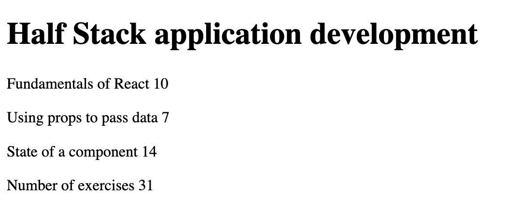
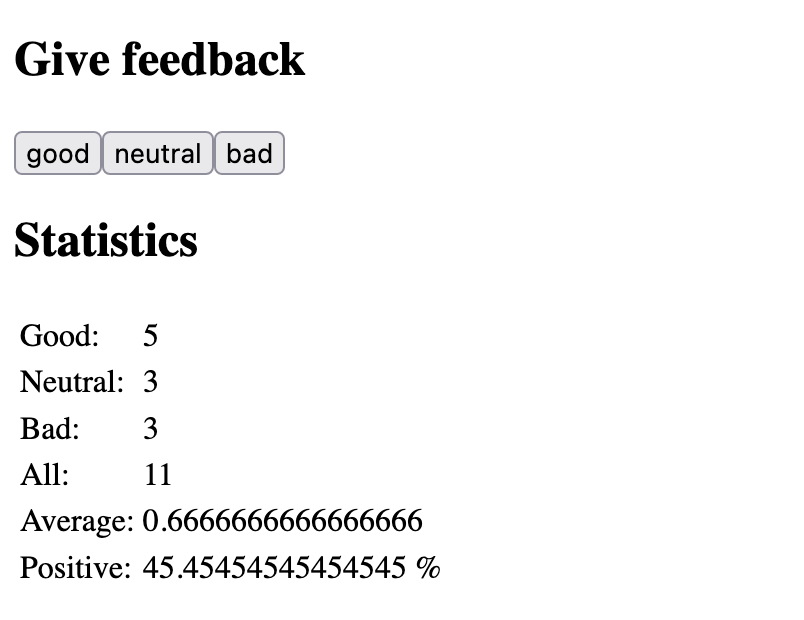
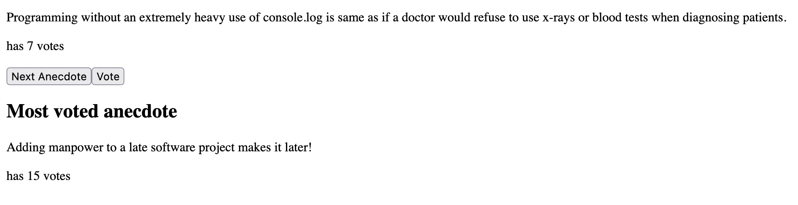

# Part 1

In this part, we will familiarize ourselves with the React-library, which we will be using to write the code that runs in the browser. We will also look at some features of JavaScript that are important for understanding React.

## Create React App replaced with Vite

Creating new application
```
npm create vite@latest courseInfo -- --template react

```

## Starting the application

```
cd courseInfo
npm install
npm run dev
```

## Solutions

### Course Info(Ex1.1 - 1.5)
[Sorce code](./courseInfo/src/App.jsx)


### Unicafe(Ex1.6-1.11)
[Sorce code](./unicafe/src/App.jsx)


### Anecdotes (Ex1.12-Ex1.14)
[Sorce code](./anecdotes/src/App.jsx)

