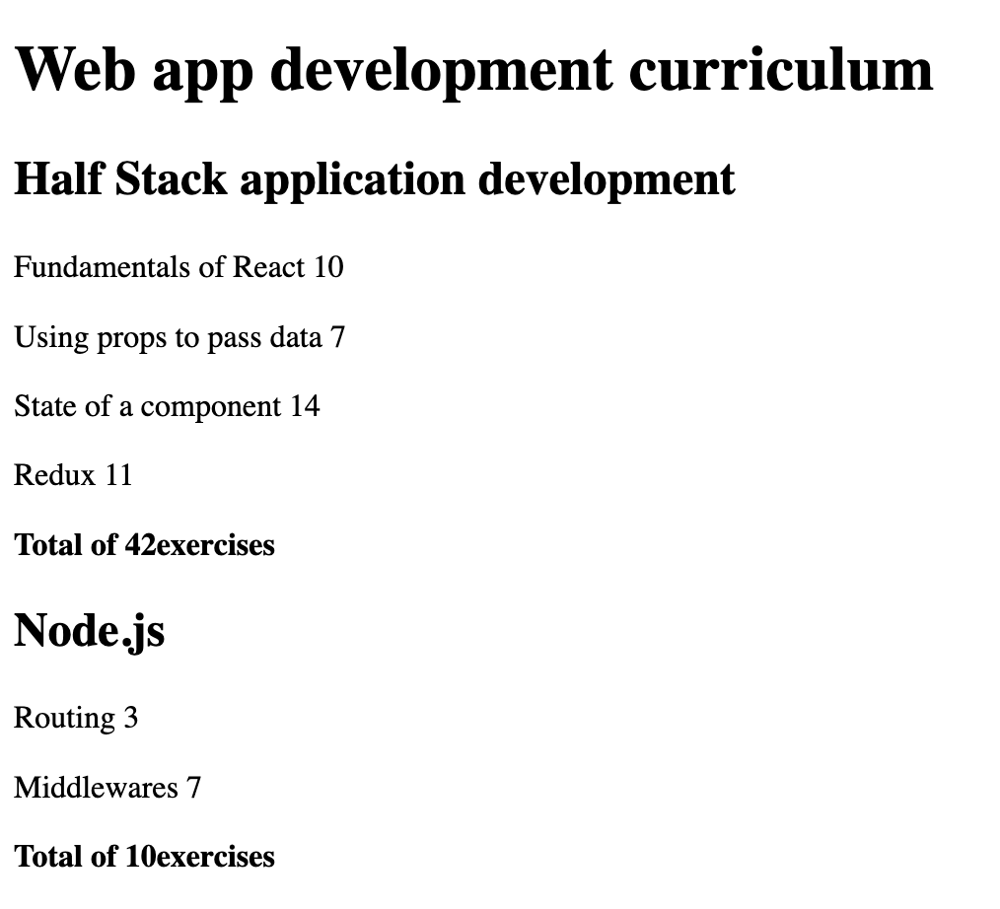
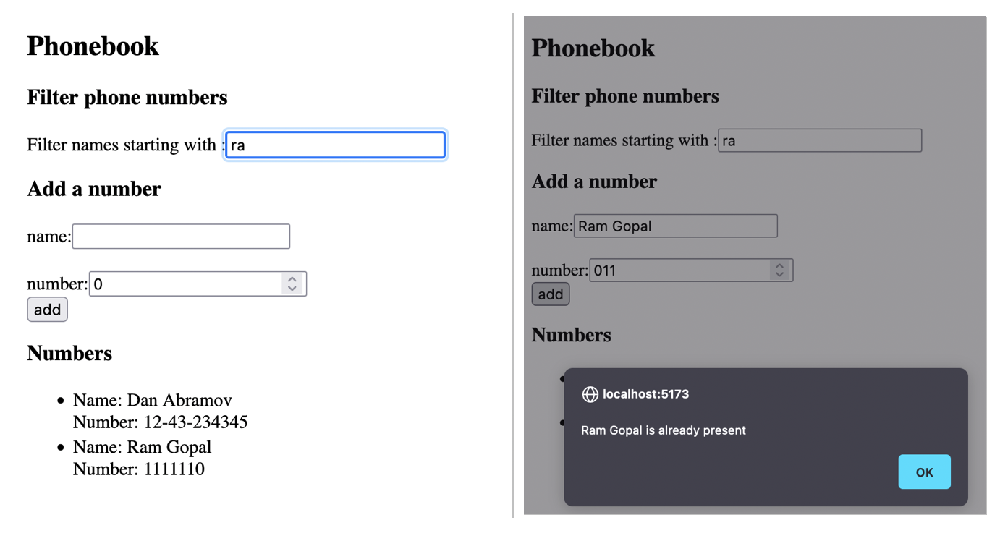
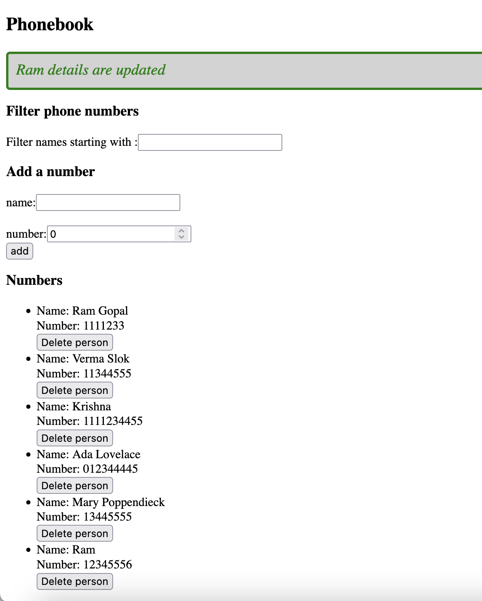

# Part 2 Communicating with server

Let's continue our introduction to React. First, we will take a look at how to render a data collection, like a list of names, to the screen. After this, we will inspect how a user can submit data to a React application using HTML forms. Next, our focus shifts towards looking at how JavaScript code in the browser can fetch and handle data stored in a remote backend server. Lastly, we will take a quick look at a few simple ways of adding CSS styles to our React applications.

## Create React App replaced with Vite

Creating new application
```
npm create vite@latest courseInfo -- --template react

```

## Starting the application

```
cd courseInfo
npm install
npm run dev
```

## Solutions

## 1. Course Info (Ex2.1-2.5)
[Sorce code](./courseInfo/src/App.jsx)


## 2. Phone Book (Ex2.6-2.10)
[Sorce code](./phoneBook/src/App.jsx)


## 3. Phone Book (Ex2.11 - 2.17)
[Sorce code](./phoneBook/src/App.jsx)
